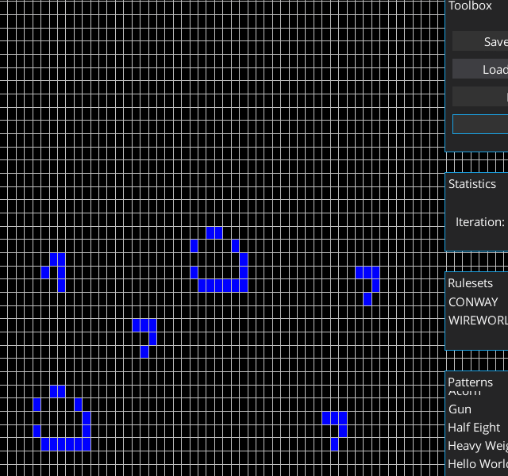
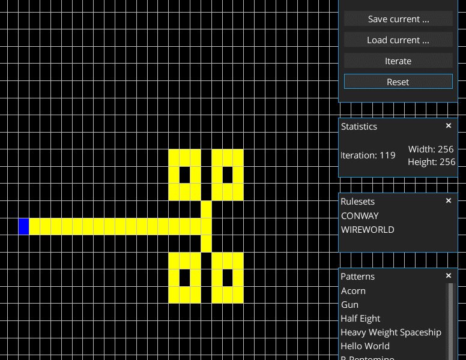

# Cellular Automaton
This project is my implementation of a cellular automata, written in Java using LibGdx.

## Features
* Original cellular automata impl.
* Support for John Conway's Game of life and Brian Silverman's Wireworld
* The rulesets can be changed during runtime
* The state of the cellular automata can be saved or loaded during runtime
* Some default patterns are included (Acorn, R-Pentomino, ...)
* Constant performance
* Open-mindedness - feel free to contribute


## Usage
* W,A,S,D - move camera along x- and y-axis
* Q - zoom in
* E - zoom out
* Space - continue iterations
* Left Mouse - change cell state
* Right mouse - reset cell state

## Prerequisites
This project is built using the java programming language and libgdx as the framework.
```
- OpenJDK or Oracle JDK version 1.8 (currently using version 1.8.0_212 - should work with earlier version of the jdk)
- gradle (use the provided wrapper from within the project)
- Hardware support for OpenGL 1.1 / 2.0
```

## Installation
These are the steps to get, compile and execute the project:
```
- git clone https://github.com/benjaminfoo/cellular_automaton_libgdx
- open the project with IntelliJ IDEA or your IDE of choice
- Run the DesktopLauncher from the Desktop-Project
```

## Screenshots

#### Game of life showcase


#### Wireworld showcase


## Common problems and fixes
#### Old hardware + Java development kit version >= 1.8.0_45
#### OpenGL is not supported by the video driver.
There is a known problem with java/libgdx when launching this application on windows and older hardware.
The simplest thing to do is to use an older version of the java development kit (<= 1.8.0_45).  

#### GdxRuntimeException: OpenGL 2.0 or higher with the FBO extension is required.
There is another known problem on older hardware without proper support of opengl, which leads to the following exception:
```
Exception in thread "LWJGL Application" com.badlogic.gdx.utils.GdxRuntimeException: OpenGL 2.0 or higher with the FBO extension is required. OpenGL version: 1.1.0
```

In order to fix it, add the following loc before libgdx gets launched:
```
System.setProperty("org.lwjgl.opengl.Display.allowSoftwareOpenGL", "true");
```

## Built With
* [OpenJDK](https://openjdk.java.net/) - The open-source implementation of the Java Platform
* [LibGDX](https://libgdx.badlogicgames.com/) - Java game development framework
* [Gradle](https://gradle.org/) - The best build tool in the java ecosystem 

## Additional Third party frameworks / libraries
* [VisUI](https://github.com/kotcrab/vis-ui/wiki/visui) - VisUI
* [Artemis-Odb](https://github.com/junkdog/artemis-odb) - Artemis-ODB ECS-Framework

## License
This project is licensed under the GNU General Public License v3.0 - see the [LICENSE.md](LICENSE.md) file for details
